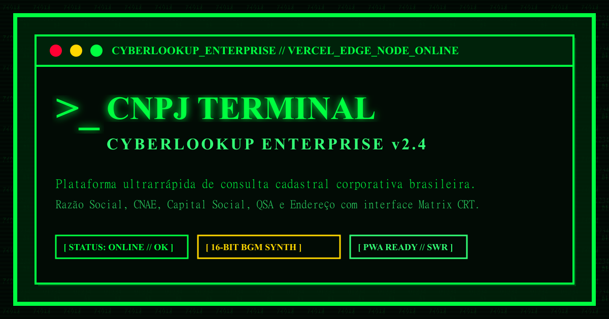

# CNPJ Terminal // CyberLookup Enterprise

<p align="center">
  
</p>

<p align="center">
  <strong>Uma plataforma web de consulta cadastral corporativa brasileira (CNPJ) ultrarrápida, minimalista e temática, inspirada na estética brutalista retro-futurista de <em>The Matrix</em> e terminais cibernéticos dos anos 80/90.</strong>
</p>

<p align="center">
  <a href="https://eager-fermi.vercel.app"></a>
  <a href="https://nextjs.org"></a>
  <a href="https://tailwindcss.com"></a>
  
  
</p>

---

## 🌐 Demonstração Online

- **Aplicação em Produção:** [https://eager-fermi.vercel.app](https://eager-fermi.vercel.app)
- **Repositório oficial:** [https://github.com/DougPomp/cnpj-terminal](https://github.com/DougPomp/cnpj-terminal)

---

## ✨ Funcionalidades Principais

- ⚡ **Consulta Ultrarrápida de CNPJ:** Respostas em menos de 100ms utilizando a infraestrutura Serverless Edge da Vercel com revalidação de 24 horas (`s-maxage=86400`).
- 🛡️ **Validação Algorítmica Client-Side:** Validação matemática dos dois dígitos verificadores do CNPJ antes de enviar qualquer requisição ao servidor.
- 🔄 **Duplo Fallback de APIs:** Resiliência com timeout de 3.5s na BrasilAPI e alternância transparente para a MinhaReceita API.
- 📱 **Progressive Web App (PWA) & Offline Shell:** Suporte completo para instalação em dispositivos móveis e desktop via Service Worker (`sw.js`) e `manifest.json`.
- 🕹️ **Música de Fundo 16-bits Chiptune (MIDI Synth):** Trilha sonora sintetizada nativa via Web Audio API (3 canais: melodia, baixo e percussão) ativada pelo botão `[BGM_16BIT]`.
- 📺 **Efeitos Visuais CRT & Matrix Rain:** Animação Canvas de chuva de código Matrix, scanlines CRT, vinheta de tubo catódico e efeito de decodificação cipher.
- 📜 **Histórico Local Encriptado:** Armazenamento automático dos últimos 5 CNPJs pesquisados no `localStorage` com clique rápido para re-examinar e botão `[CLEAR_HISTORY]`.
- 🖥️ **Console Logs do Sistema:** Streaming em tempo real das operações do terminal no estilo Unix.

---

## 🛠️ Tecnologias Utilizadas

| Tecnologia | Função no Projeto |
| :--- | :--- |
| **Next.js 14 (App Router)** | Framework React full-stack com Serverless Edge Functions |
| **TypeScript** | Tipagem estática rigorosa para dados empresariais e contratos de API |
| **Tailwind CSS** | Estilização brutalista customizada sem border-radius (`0px`) e sombras 90° |
| **Web Audio API** | Sintetizador de áudio nativo para efeitos sonoros e música de fundo 16-bits |
| **Lucide React** | Conjunto de ícones vetoriais cibernéticos |
| **Service Worker / PWA** | Instalação nativa em dispositivos e cache de ativos offline |

---

## 📁 Estrutura de Pastas do Projeto

```text
eager-fermi/
├── app/
│   ├── api/cnpj/[cnpj]/route.ts  # Endpoint Serverless com fallback de APIs
│   ├── globals.css                # Estilos globais e efeitos CRT Matrix
│   ├── layout.tsx                 # Layout base, metadados SEO, PWA e OpenGraph
│   └── page.tsx                   # Página principal montada com componentes
├── components/
│   ├── CipherEffect.tsx           # Animação de decodificação de texto Matrix
│   ├── CnpjInputForm.tsx          # Form de entrada com máscara 00.000.000/0001-00
│   ├── CompanyResultCard.tsx      # Exibição dos dados cadastrais e tabela QSA
│   ├── CRTContainer.tsx           # Wrapper de filtros CRT e scanlines
│   ├── MatrixBackground.tsx       # Canvas HTML5 de chuva de código Matrix
│   ├── PWAProvider.tsx            # Registro do Service Worker e botão de instalação
│   ├── SearchHistory.tsx          # Histórico dos últimos 5 CNPJs (localStorage)
│   ├── TerminalConsoleLogs.tsx    # Stream de logs Unix do terminal
│   ├── TerminalFooter.tsx         # Rodapé com aviso de conformidade LGPD
│   ├── TerminalHeader.tsx         # Topbar com relógio BRT, áudio e CRT toggle
│   └── TerminalInfoFaq.tsx        # Seção Sobre e FAQ estruturado para SEO
├── docs/
│   ├── prd.md                     # Documento de Requisitos do Produto (PRD)
│   ├── spec.md                    # Especificação Técnica Arquitetural (SPEC)
│   └── design.md                  # Guia do Design System Matrix CRT Brutalist
├── lib/
│   ├── audio.ts                   # Sintetizador Web Audio API e BGM 16-bits
│   └── cnpj.ts                    # Algoritmo de validação de CNPJ e formatadores
├── public/
│   ├── manifest.json              # Web App Manifest PWA
│   ├── sw.js                      # Service Worker para suporte offline
│   ├── icon.svg / icon.png        # Ícones HD em vetor e PNG
│   └── og-image.png / og-image.svg# Banner OpenGraph em alta definição (1200x630)
├── scripts/
│   └── convert-png.js             # Script de conversão de imagens para PNG HD
├── package.json
└── README.md
```

---

## 🚀 Como Executar o Projeto Localmente

### Pré-requisitos
- **Node.js**: versão 18.17.0 ou superior
- **npm**: versão 9.0.0 ou superior

### Passos

1. **Clonar o repositório:**
   ```bash
   git clone https://github.com/DougPomp/cnpj-terminal.git
   cd cnpj-terminal
   ```

2. **Instalar as dependências:**
   ```bash
   npm install
   ```

3. **Iniciar o servidor de desenvolvimento:**
   ```bash
   npm run dev
   ```

4. **Acessar no navegador:**
   Abra [http://localhost:3000](http://localhost:3000)

5. **Gerar a compilação de produção:**
   ```bash
   npm run build
   ```

---

## 📚 Documentação Adicional

Toda a documentação arquitetural e especificações do projeto estão organizadas na pasta [`docs/`](file:///c:/Users/Doug/Documents/antigravity/eager-fermi/docs):

- 📄 [Documento de Requisitos do Produto (PRD)](file:///c:/Users/Doug/Documents/antigravity/eager-fermi/docs/prd.md)
- ⚙️ [Especificação Técnica Arquitetural (SPEC)](file:///c:/Users/Doug/Documents/antigravity/eager-fermi/docs/spec.md)
- 🎨 [Guia do Design System Matrix CRT Brutalism](file:///c:/Users/Doug/Documents/antigravity/eager-fermi/docs/design.md)

---

## 🔒 Segurança & LGPD

Esta aplicação utiliza exclusivamente dados públicos de pessoas jurídicas provenientes da **Receita Federal do Brasil**, em estrita conformidade com a **Lei de Acesso à Informação (Lei nº 12.527/2011)**. Nenhum dado do usuário ou histórico de busca é retido nos servidores.

---

<p align="center">
  CYBERLOOKUP ENTERPRISE &copy; 2026 — MATRIX CRT TERMINAL ENGINE
</p>
